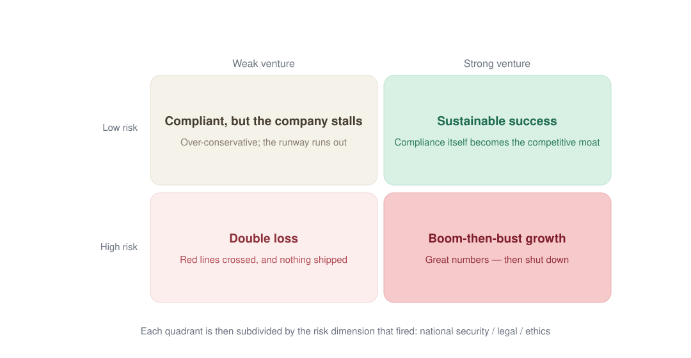
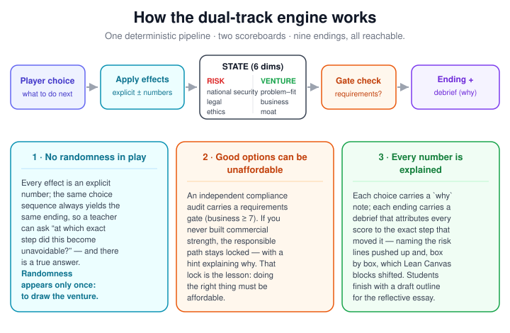

<div align="center">

# 一念之差 · Choices

A retro arcade–style interactive branching-narrative simulator for classroom teaching — every choice moves two scoreboards at once (risk **and** the business), deterministically, and leads to its corresponding ending.

**▶ Play Online: <https://drhycheung.github.io/Choices/>**

</div>

---

**Built for:** [The Education University of Hong Kong (EdUHK)](https://www.eduhk.hk) — **GEL2026 Technology Entrepreneurship in AI-enhanced Business and National Security**, and also usable in **GEL1032 Technology Entrepreneurship in AI-enhanced Business**.


Students read a story, make choices, and trigger different branches and endings. Six scenario packs ship with the game — an AI fitness app, an AI hiring screener, AI avatar commerce, campus learning analytics, drone inspection, and AI trade documentation — and each play **randomly draws one of them**, so replaying never repeats the same story. Within a story there is zero randomness: the same choice sequence always produces the same ending. Built as a front-end-only, no-build, no-backend teaching tool to spark classroom discussion on entrepreneurship, decision-making, responsibility, and the rule of law.

Files: `index.html`, `engine.js`, `player.js`, `validate.js`, `scenarios/*.json` — no build step, no backend, no API key. Open it in a browser or deploy to GitHub Pages. The pixel/retro fonts load from a CDN; everything else runs locally (generated copies of all scenarios and the shared endings live in `embed/`, so the file still works when double-clicked).

---

## 1. Where this project fits: learning by consequence

Many students struggle to feel how an everyday decision can cross a legal, ethical, or even national-security red line. Abstract warnings rarely land; lived consequence does. Branching narrative turns that into a safe, repeatable experience:

- **Capture attention:** the familiar arcade framing lowers the barrier to a "serious" topic.
- **Make consequences visible:** the dual-track dashboard shows exactly how each choice moves the numbers.
- **Provide immediate, explainable feedback:** the Decision Trail replays choice → effect → *why*, so causality is not just true but *seen*.
- **Close the loop with a debrief:** every ending explains why it fired, what was traded away, who was affected, what could have been done instead, and how the run reads through the Lean Canvas.
- **Reusable across topics:** the engine is generic; add new ventures as independent JSON packets.

---

## 2. The course it was built for: GEL2026

This game was written for **GEL2026 · Technology Entrepreneurship in AI-enhanced Business and National Security** at [The Education University of Hong Kong](https://www.eduhk.hk). It also works unchanged in **GEL1032 · Technology Entrepreneurship in AI-enhanced Business**, which covers the same entrepreneurial ground without the national-security strand.

**What the course asks students to hold at once.** GEL2026 is a two-strand course. One strand is technology entrepreneurship: how AI and digital technologies create value, how a venture is planned and validated (customer segments, problems, solution, channels, revenue, unfair advantage), how a proposal is pitched. The other is national security education: how data, models and platforms can touch national-security, legal and ethical red lines, and what the law expects of the people who build them. Students are assessed on a business proposal, a pitch, and a reflective essay on a real AI business and its national-security implications.

**The gap this game fills.** Taught separately, the two strands produce two familiar failure modes. Students write a business plan and bolt compliance on at the end as a slide nobody reads. Or they learn that security means "do not do it", which teaches nothing about running a company. Neither failure mode can survive a scoreboard where both tracks move on every single click.

| Course concern | What the game makes the student do |
|---|---|
| Digital / AI value creation | The venture track scores problem–solution fit, business model and moat — the Lean Canvas blocks from class — so pressing a button *is* practising the canvas |
| Customer and problem validation | Act I forces a choice between interviewing users and chasing vanity metrics, and the scoreboard remembers which one paid |
| AI data and model decisions | Acts II–III put training data, offshore processing and deployment on the scoreboard with explicit national-security and legal consequences |
| National security, legal and ethical implications | Three separate risk dimensions, so "it is legal but creepy" and "it is safe but unlawful" are different scores, not one blurred warning |
| Accountability and mitigation | Act IV offers a passive fix, a denial, or a real audit — and the audit is gated behind commercial strength, because responsibility has to be affordable |
| Reflective essay | Every ending ends in a debrief: why it fired, the trade-off, who was affected, what could have been done, and the Lean Canvas reading — a draft skeleton for the essay |

**Suggested classroom use.** Play one run individually or in pairs (15–20 minutes), pin a venture with `?scenario=ai-fitness` so the whole room compares like with like, then put the four quadrants of the outcome space on the board and ask who landed where and at which step it became unavoidable. Because the run is deterministic, "which step did it?" always has a true answer.

---

## 3. Design philosophy: the dual-track scoreboard

The design question this game answers is: **what happens when a student is never allowed to "just pick the safe option"?**

A single risk scoreboard has a hidden flaw. After two or three plays, a clever student learns the optimal strategy — *always choose the most conservative option* — and collects the "good ending". That is precisely the wrong lesson for an entrepreneurship course: in the real economy, compliance has a cost, growth has a purpose, and a company that refuses every commercial risk protects no one.

So every choice in this game feeds **two scoreboards at once**:

| Track | Dimensions | Direction |
|---|---|---|
| **Risk track** | National security · Legal compliance · Ethics and trust | lower is better |
| **Venture track** | Problem–solution fit (Canvas 1–4) · Business model (Canvas 5–7) · Moat and unfair advantage (Canvas 8–9) | higher is better |

The venture dimensions map directly onto the Lean Canvas blocks covered in class, so pressing a button *is* practising the canvas. Endings are gated by **both tracks together**, producing a two-dimensional outcome space:

- **Low risk + strong business** → a sustainable company (compliance itself becomes the moat).
- **Low risk + weak business** → *clean, but going nowhere* — over-caution quietly kills the venture.
- **High risk + strong business** → *great numbers, then shut down* — growth amplifies the exposure.
- **High risk + weak business** → both lines breached and nothing shipped.

"Low risk" is therefore not one ending but a whole quadrant — and each quadrant is then subdivided by the risk dimension that actually fired (national security, legal, or ethics):



Three further design rules keep the tension honest:

1. **No randomised outcomes, ever.** Randomness exists only at the very start, to draw which venture you run. Inside a story, every effect is an explicit number and every ending is a defined consequence of your choices — so a teacher can ask "at which exact step did this become unavoidable?" and there is a true answer.
2. **Good options can be unaffordable.** Some of the best choices (an independent compliance audit, for example) carry a `requirements` gate on the business score: if you never built commercial strength, you cannot pay for the responsible path. The button stays visible but locked, with a hint explaining why — which is itself the lesson.
3. **Every number is explained, and traced back to a step.** Each choice carries a `why` note (shown in the Decision Trail) stating why it raises or lowers each dimension. Every ending carries a full debrief: why it fired, the trade-off made, stakeholders affected, concrete mitigations, and a Lean Canvas reading. The debrief then closes the loop by attributing each number to the decisions that actually moved it — the risk section names the steps that pushed the risk lines up, and the Canvas section lists, box by box, which steps changed it and by how much. Students finish a run holding a draft outline for their reflective essay — issue identification with legal hooks, stakeholder analysis, and mitigation strategies.

And here is how the two scoreboards are wired together: every choice writes one set of `effects` into **both** tracks at once, and the ending is gated by the two score sets jointly — low risk alone is not a good company, and high growth alone is not a good ending:



Each story runs **at least fifteen decision rounds**, paced so that consequences can accumulate and compound — fast enough to finish in class, slow enough that early choices visibly cause late endings. Two of those rounds are branch points that open a *persistent branch arc*: several decisions written for the choice you made, which then rejoins the shared track.

The story is **not a straight ladder**. Most steps are shared by everyone — so a class can still compare answers question by question — but two decision points (how you sourced your training data, and how you answered the first harm your product caused) send you onto a *persistent branch arc*: several questions written for that decision, which the other players never see, before the arc rejoins the shared track. Endings stay comparable.

---

## 4. What the game does

| Feature | Implementation |
|---|---|
| Interactive branching narrative | Pure front-end engine (`engine.js`) advances nodes by player choices; every choice carries its own `next`, and two decision points per venture open a persistent branch arc with questions the other players never see |
| Venture brief before the story | Each pack opens with a structured briefing (what it does · who buys it · where it stands · data it touches) above the first node, so plot events like "your first customer is…" always have context. The cover shows only the venture name and hook |
| Six venture scenarios | `scenarios/manifest.json` lists the packs; each play randomly draws one (or force one with `?scenario=<id>`) |
| Dual-track dashboard | Six segmented neon bars in two groups — risk (red alarm past threshold) and venture (green when strong) |
| Deterministic cause → effect | Each choice carries explicit `effects` (no RNG in play); endings are gated by joint `condition`s on both tracks |
| Locked choices with reasons | `requirements` gates (e.g. the audit needs business ≥ 7) show a `lockedHint` instead of silently disabling |
| Per-choice "why" notes | The Decision Trail shows each step's chapter, choice, score deltas and the causal explanation |
| Full ending debrief | Trigger · trade-off · stakeholders · mitigations · Lean Canvas reading · legal hooks, in both languages |
| Debrief traces back to decisions | The ending opens with a per-dimension **score ledger** (start → final, signed net change, and a worse/better verdict per dimension) and attributes every score to the exact steps that moved it |
| Export a study report | The ending page exports the whole run as **Markdown** (score ledger, all 15 decisions with their deltas and reasons, full debrief) for printing or submission, or as **JSON** for marking and further analysis. Generated entirely in the browser — no backend |
| Replayable without repetition | Six ventures, random draw on every start, plus a shuffle button on the start screen and the ending screen |
| Multiple endings | 9 shared endings per scenario; the validator proves every one is reachable |
| Bilingual ZH / EN | Every player-facing string is `{ "zh": …, "en": … }`; toggle anytime via the header switch |
| Static & portable | No server required; deploy to GitHub Pages or double-click the HTML |
| Extensible scenarios | Add a packet to `scenarios/`, list it in the manifest, re-run the embed script |

### Scenario format (the data packet)

A scenario is a JSON file with a `brief` (the venture briefing — what the business does, who buys it, where it stands, what data it touches — shown before the story starts), `dimensions` (grouped into `risk` / `venture`), a `start` node id, `nodes` (text + `choices` each with `effects`, an optional `why`, and optional `requirements`/`lockedHint`), an `acts` chapter map, and a per-scenario `endingFlavor`. Endings themselves live in a **shared file** (`scenarios/endings-core.json`) so every venture uses the same outcome system. Minimal shape:

```json
{
  "brief": {
    "product":  { "zh": "…", "en": "What the product does" },
    "customer": { "zh": "…", "en": "Who buys it" },
    "standing": { "zh": "…", "en": "Where the venture stands today" },
    "data":     { "zh": "…", "en": "What data it handles — the seed of the risk track" }
  },
  "dimensions": {
    "national_security": { "label": { "zh": "…", "en": "National security risk" },
                            "initial": 0, "min": 0, "max": 10,
                            "higherIsRisk": true, "group": "risk", "icon": "🛡️" },
    "business": { "label": { "zh": "…", "en": "Business model" },
                  "initial": 2, "min": 0, "max": 10,
                  "higherIsRisk": false, "group": "venture", "icon": "💰" }
  },
  "start": "intro",
  "nodes": {
    "intro": { "act": "act1",
               "text": { "zh": "…", "en": "…" },
               "choices": [ { "text": { "zh": "…", "en": "…" }, "next": "next_id",
                              "effects": { "business": 2, "ethics": 1 },
                              "why": { "zh": "…", "en": "…" } } ] }
  }
}
```

### Adding a new venture theme

The engine never changes — you only write story data:

1. **Copy a packet:** `cp scenarios/ai-fitness.json scenarios/your-topic.json` and rewrite the narrative, keeping the dimension keys and the two-track effect balance.
2. **Register it:** add an entry to `scenarios/manifest.json` (id, file, title, hook).
3. **Generate the offline copies:** run `python3 tools/embed-scenarios.py`. It writes `embed/<scenario>.js` plus `embed/endings.js` and refreshes the small manifest block inside `index.html`. Commit the regenerated files. The scenarios stay out of `index.html` on purpose: browsers only fire `DOMContentLoaded` after the whole document is parsed, so inlining ~284 KB of JSON delayed the first paint by over a second.
4. **Validate:** `node validate.js scenarios/your-topic.json` proves no dead-ends, that every ending is reachable, and that each story runs at least ten rounds.
5. **Test:** `node test.js` searches a triggering path for every ending and replays it twice to confirm determinism.

Tip: you can author scenes with an AI assistant — feed it the schema and the shared endings file, then run the validator.

---

## 5. Technology choices

| Decision | Rationale |
|---|---|
| Vanilla JavaScript (no framework) | Transparent for teaching; students can read and modify the engine without framework overhead |
| Engine / scenario separation | Generic engine + independent JSON packets → add new ventures without touching code |
| Shared endings across scenarios | One outcome system (with full debriefs) keeps six stories comparable and the data maintainable |
| Deterministic `effects` (no RNG in play) | Educational causality must be reproducible and explainable — no dice, no luck |
| Pure static site | Meets the hard requirement: deploy anywhere, zero ops, works in China (no Google services) |
| Offline scenario copies | `file://` double-click works despite browsers blocking `fetch` of local files; `tools/embed-scenarios.py` writes them to `embed/` and keeps them in sync. Keeping them out of `index.html` cuts `DOMContentLoaded` from ~228 ms to ~12 ms |
| Path / causal validator | `validate.js` proves no dead-ends, that every ending is reachable, and that stories run ≥ 10 rounds |
| Pixel / neon arcade skin | Familiar retro-game feel lowers the participation barrier (Press Start 2P + CRT scanlines) |

---

## 6. How to run

- **Locally (no server needed):** double-click `index.html` in any modern browser.
- **Locally with server:** `python3 -m http.server 8000` then open `http://localhost:8000/`.
- **GitHub Pages (your own deployment):** push the repo, then **Settings → Pages → Deploy from a branch** (select branch and `/ (root)`). Live at `https://<your-username>.github.io/Choices/`.
- **Pick a venture:** `?scenario=ai-fitness` (any id from the manifest). **Set language:** `?lang=zh` or `?lang=en`.

Desktop and mobile are supported (responsive layout). Choices give pressed-state feedback on touch screens, and options that are locked by a requirement explain themselves instead of looking broken.

**There is an easter egg.** On the start screen, press ↑ ↑ ↓ ↓ ← → ← → B A (or tap the logo seven times on a phone). It changes nothing about scoring or endings — it is a note to the curious student about how the game works.

---

## 7. Known limitations

| Limitation | Consequence |
|---|---|
| Text-only interaction | No rich media; relies on narrative + choices (deliberate, easy to author) |
| Random draw is per page load | The scenario is drawn once per visit; use `?scenario=` for a fixed classroom demo |
| Reflection is optional | Depends on teacher facilitation; the debrief supports but does not replace it |
| Shared endings are generic | The debrief text is venture-agnostic; each story adds its own one-line flavour |
| Validator is structural | Checks reachability / causality / length, not pedagogical quality |
| Fonts / CRT from CDN | Pixel font needs internet on first load; falls back to system fonts offline |

---

## 8. Documentation

| Document | What it covers |
|---|---|
| **[Vibe-coding guide](docs/vibe-coding.md)** | Design thinking behind this project, how it was built with an AI coding tool, and a complete prompt to reproduce it for classroom use |

---

## 9. Licences and attribution

- **Code:** MIT — see [LICENSE](LICENSE), © 2026 一念之差 / Choices contributors.
- **Press Start 2P:** CodeMan38, SIL Open Font License 1.1.
- **ZCOOL QingKe HuangYou:** Google Fonts.
- **Game concept:** original; visual style inspired by classic arcade games. No original arcade assets are used.

The MIT licence above covers this repository's code only and does not extend to the third-party fonts, which remain under their own terms.
