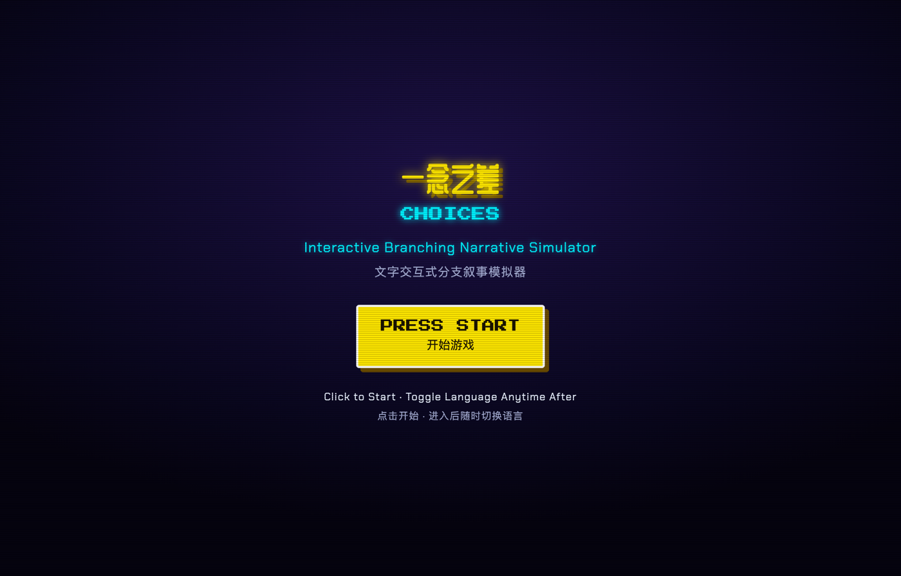

<div align="center">

# 一念之差 · Choices

A retro arcade–style interactive branching-narrative simulator for classroom teaching — every choice deterministically changes risk scores and leads to its corresponding ending.

**▶ Play Online: <https://drhycheung.github.io/Choices/>**

</div>

---

**Built for:** [The Education University of Hong Kong (EdUHK)](https://www.eduhk.hk) — **GEL2026 Technology Entrepreneurship in AI-enhanced Business and National Security**, and also usable in **GEL1032 Technology Entrepreneurship in AI-enhanced Business**.



A retro arcade–style educational game where students read a story, make choices, and trigger different branches and endings. The first scenario puts a student entrepreneur in situations involving **national-security, legal, and ethical** risk — every choice deterministically changes risk scores and leads to a corresponding ending. It was created as a front-end-only, no-build, no-backend teaching tool for **EdUHK (The Education University of Hong Kong) GEL2026 Technology Entrepreneurship in AI-enhanced Business and National Security** (and is likewise suited to **GEL1032 Technology Entrepreneurship in AI-enhanced Business**) to spark classroom discussion on decision-making, responsibility, and the rule of law.

Files: `index.html`, `engine.js`, `player.js`, `validate.js`, `scenarios/*.json` — no build step, no backend, no API key. Open it in a browser or deploy to GitHub Pages. The pixel/retro fonts load from a CDN; everything else runs locally (a copy of the scenario is also embedded in `index.html` so the file works even when double-clicked).

---

## 1. Where this project fits: Learning by consequence

Many students struggle to feel how an everyday decision can cross a legal, ethical, or even national-security red line. Abstract warnings rarely land; lived consequence does. Branching narrative turns that into a safe, repeatable experience:

- **Capture attention:** the familiar arcade framing lowers the barrier to a "serious" topic.
- **Make consequences visible:** the Risk Monitor shows exactly how each choice moves the numbers.
- **Provide immediate, explainable feedback:** the Decision Trail replays choice → effect → score, so causality is not just true but *seen*.
- **Encourage reflection:** each ending carries an optional reflection prompt (teachers can also add them live in class).
- **Reusable across topics:** the engine is generic; add internship, research, or other scenarios as independent JSON packets.

---

## 2. What the game does

| Feature | Implementation |
|---|---|
| Interactive branching narrative | Pure front-end engine (`engine.js`) advances nodes by player choices |
| Deterministic cause → effect | Each choice carries explicit `effects` (no RNG); endings are gated by risk-score `condition` |
| Risk Monitor (HUD) | Three segmented neon bars — National Security / Law / Ethics — with a danger pulse past the threshold |
| Multiple endings | success / per-dimension fail / compromise; all reachable and validator-checked |
| Bilingual ZH / EN | Every player-facing string is `{ "zh": …, "en": … }`; toggle anytime via the header switch |
| Decision Trail | Records each choice + its effect + final scores, shown on the result screen |
| Optional reflection | Per-ending reflection prompts; not enforced, by design (teacher-led) |
| Static & portable | No server required; deploy to GitHub Pages or double-click the HTML |
| Extensible scenarios | Drop a new `scenarios/*.json` packet; the engine stays generic |

### Scenario format (the data packet)

A scenario is a JSON file with: `dimensions` (risk axes + icons), a `start` node id, `nodes` (text + `choices` each with optional `effects`), and `endings` (gated by `condition`). Minimal shape:

```json
{
  "dimensions": {
    "national_security": { "label": { "zh": "…", "en": "National Security Risk" },
                            "initial": 0, "min": 0, "max": 10, "higherIsRisk": true, "icon": "🛡️" }
  },
  "start": "intro",
  "nodes": {
    "intro": { "text": { "zh": "…", "en": "…" },
               "choices": [ { "text": { "zh": "…", "en": "…" }, "next": "next_id",
                              "effects": { "national_security": 2 } } ] }
  },
  "endings": {
    "fail_ns": { "title": { "zh": "…", "en": "Technology Leak Crisis" },
                 "type": "fail", "condition": { "national_security": ">=5" },
                 "text": { "zh": "…", "en": "…" } }
  }
}
```

### Changing or adding a theme

The shipped theme is **student entrepreneurship × national security / law / ethics**. To use a different
topic (internship, research, campus life, …) you only rewrite the *story data* — the engine never changes:

1. **Copy the packet:** `cp scenarios/student-startup.json scenarios/your-topic.json`.
2. **Edit the story:** change `dimensions` (the risk axes), `nodes` (text + `choices` with `effects`),
   and `endings` (gated by `condition`). Keep the `{ "zh": …, "en": … }` shape for bilingual text.
3. **Run it:** open `?scenario=scenarios/your-topic.json`, or set it as the default in `player.js`
   (change the fetch path inside `init`).
4. **Offline build:** also paste the edited JSON into the `<script id="embedded-scenario">` block in
   `index.html` so double-clicking the file uses the new story.
5. **Validate:** `node validate.js scenarios/your-topic.json` to prove no dead-ends and that every
   ending is reachable before shipping.

Tip: you can author scenes with an AI assistant — just feed it this schema and run the validator.

---

## 3. Design decisions: Technology choices

| Decision | Rationale |
|---|---|
| Vanilla JavaScript (no framework) | Transparent for teaching; students can read and modify the engine without framework overhead |
| Engine / scenario separation | Generic engine + independent JSON packets → add new topics without touching code |
| Deterministic `effects` (no RNG) | Educational causality must be reproducible and explainable — no dice, no luck |
| Pure static site | Meets the hard requirement: deploy anywhere, zero ops, works in China (no Google services) |
| Embedded scenario copy | `file://` double-click works despite browsers blocking `fetch` of local files |
| Path / causal validator | `validate.js` proves no dead-ends and that every ending is reachable (ideal for AI-authored scenes) |
| Pixel / neon arcade skin | Familiar retro-game feel lowers the participation barrier (Press Start 2P + CRT scanlines) |

---

## 4. How to run

- **Locally (no server needed):** double-click `index.html` in any modern browser.
- **Locally with server:** `python3 -m http.server 8000` then open `http://localhost:8000/`.
- **GitHub Pages (your own deployment):** push the repo, then **Settings → Pages → Deploy from a branch** (select branch and `/ (root)`). Live at `https://<your-username>.github.io/Choices/`.
- **Pick a scenario:** `?scenario=scenarios/xxx.json`. **Set language:** `?lang=zh` or `?lang=en`.

Desktop and mobile are supported (responsive layout). When editing `scenarios/*.json`, re-sync the embedded copy inside `index.html` if you want the offline double-click build to reflect the change.

---

## 5. Known limitations

| Limitation | Consequence |
|---|---|
| Text-only interaction | No rich media; relies on narrative + choices (deliberate, easy to author) |
| Reflection is optional | Depends on teacher facilitation; not enforced by the engine |
| Embedded copy must be synced | Editing `scenarios/*.json` requires re-syncing the embedded block for offline use |
| Validator is structural | Checks reachability / causality, not pedagogical quality |
| Fonts / CRT from CDN | Pixel font needs internet on first load; falls back to system fonts offline |

---

## 6. Documentation

| Document | What it covers |
|---|---|
| **[Vibe-coding guide](docs/vibe-coding.md)** | Design thinking behind this project, how it was built with an AI coding tool, and a complete prompt to reproduce it for classroom use |

---

## 7. Licences and attribution

- **Code:** MIT — see [LICENSE](LICENSE), © 2026 一念之差 / Choices contributors.
- **Press Start 2P:** CodeMan38, SIL Open Font License 1.1.
- **ZCOOL QingKe HuangYou / VT323:** Google Fonts.
- **Game concept:** original; visual style inspired by classic arcade games. No original arcade assets are used.

The MIT licence above covers this repository's code only and does not extend to the third-party fonts, which remain under their own terms.
